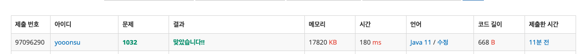
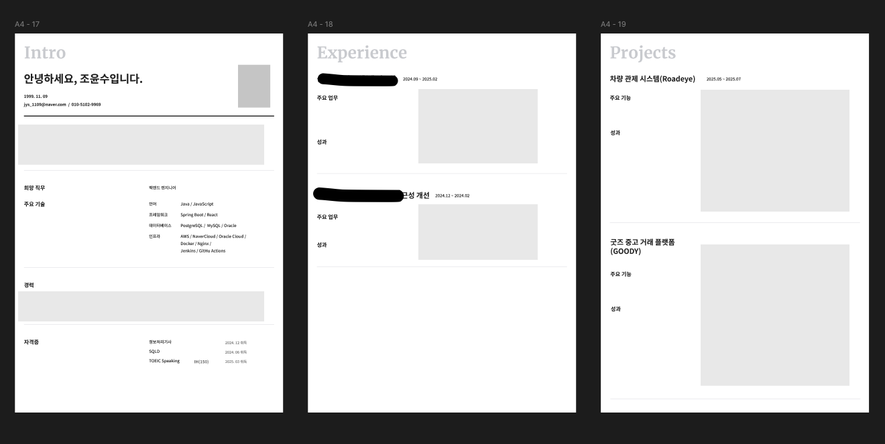

### 백준 1032번

```java
public class Solution {
    public static void main(String[] args) {
        // 여기에 코드를 작성하세요
        Scanner sc = new Scanner(System.in);
		int number = sc.nextInt();
		String[] filenames = new String[number];
		for(int i=0; i<number; i++){
			filenames[i] = sc.next();
		}
		sc.close();

		StringBuilder answer = new StringBuilder();
		for(int i=0;i<filenames[0].length();i++){
			int check = 0;
			for(int j=1;j<filenames.length;j++){
				if(filenames[0].charAt(i)!=filenames[j].charAt(i)) {
					answer.append("?");
					check++;
					break;
				}
			}
			if(check==0){
				answer.append(filenames[0].charAt(i));
			}
		}

		System.out.println(answer);
    }
}
```



### 이력서 수정
