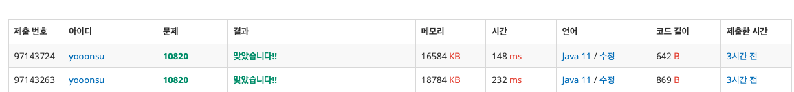

#### 백준 10820번

```java
import java.io.BufferedReader;
import java.io.IOException;
import java.io.InputStreamReader;

public class qpiwp {
public static void main(String[] args) throws IOException {
BufferedReader br = new BufferedReader(new InputStreamReader(System.in));
String line;
while((line = br.readLine())!=null){
int[] num = new int[4];
for(char c : line.toCharArray()){
if(Character.isLowerCase(c)) num[0]++;
else if(Character.isUpperCase(c)) num[1]++;
else if(Character.isDigit(c)) num[2]++;
else if(Character.isWhitespace(c)) num[3]++;
}
System.out.println(num[0] + " " + num[1] + " " + num[2] + " " + num[3]);
}
}
}
```

